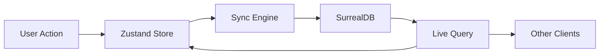
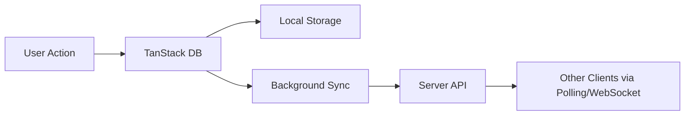

# Sync Engine vs TanStack DB: Comprehensive Comparison

## Overview

This document provides a detailed comparison between the **Sync Engine Library** and **TanStack DB**, two different approaches to client-side data management and synchronization.

## Quick Summary

| Aspect | Sync Engine Library | TanStack DB |
|--------|-------------------|-------------|
| **Primary Focus** | Real-time sync between client state and database | Client-side database with query capabilities |
| **Architecture** | Sync layer + State management | Embedded database + Query engine |
| **Real-time** | ✅ Built-in live queries | ❌ Requires external setup |
| **Offline-first** | ✅ Native support | ✅ Native support |
| **Collaboration** | ✅ Operational transforms, cursors | ❌ Not built-in |
| **State Management** | ✅ Zustand integration | ⚠️ Requires separate solution |
| **Learning Curve** | Medium | Low-Medium |
| **Maturity** | Custom/New | Alpha (TanStack ecosystem) |

---

## Detailed Comparison

### 1. Architecture & Philosophy

#### Sync Engine Library
```typescript
// Sync-first architecture
const syncEngine = await SyncEngineAPI.create(config);
const todoMiddleware = syncEngine.createMiddleware('todos');

const useTodoStore = create(todoMiddleware((set, get) => ({
  todos: [],
  addTodo: (todo) => set(state => ({ todos: [...state.todos, todo] }))
})));
```

**Philosophy**: Bridge the gap between client state and server database with real-time synchronization.

**Key Characteristics**:
- Treats the server database as the source of truth
- Client state is a synchronized view of server data
- Automatic conflict resolution and operational transforms
- Built for collaborative, real-time applications

#### TanStack DB
```typescript
// Database-first architecture
import { db } from '@tanstack/db'

const todos = db.table('todos', {
  id: 'string',
  text: 'string', 
  completed: 'boolean'
});

const allTodos = await todos.select().execute();
```

**Philosophy**: Bring database capabilities directly to the client with familiar SQL-like operations.

**Key Characteristics**:
- Client-side database with full query capabilities
- Treats client as primary database with sync as secondary concern
- Familiar database patterns (tables, queries, indexes)
- Built for offline-first applications with eventual sync

### 2. Data Flow Patterns

#### Sync Engine Library


**Flow**: User → State → Sync → Database → Live Updates → All Clients

#### TanStack DB


**Flow**: User → Local DB → Storage → Background Sync → Server → Polling/WebSocket

### 3. Real-time Capabilities

#### Sync Engine Library ✅
```typescript
// Built-in real-time sync
await syncEngine.initialize(dbAdapter);

// Automatic live queries
syncEngine.on('change-synced', (event, data) => {
  console.log('Real-time update:', data);
});

// Collaboration features
const session = await syncEngine.startCollaboration(documentId, userId);
await syncEngine.updateCursor(session.id, 'content', position);
```

**Real-time Features**:
- ✅ Live queries with SurrealDB
- ✅ Operational transforms for text editing
- ✅ Cursor tracking and presence
- ✅ Conflict resolution
- ✅ Cross-client synchronization

#### TanStack DB ❌
```typescript
// No built-in real-time - requires external setup
const todos = db.table('todos');

// Manual polling or external WebSocket setup required
setInterval(async () => {
  const updates = await fetch('/api/todos/updates');
  await todos.merge(updates);
}, 5000);
```

**Real-time Limitations**:
- ❌ No built-in real-time sync
- ❌ Requires external WebSocket/polling setup
- ❌ No collaboration features
- ❌ Manual conflict resolution

### 4. Offline Capabilities

#### Sync Engine Library ✅
```typescript
// Automatic offline queue
const config = {
  offlineSupport: true,
  retryAttempts: 10,
  syncInterval: 5000
};

// Changes queued when offline
addTodo({ text: 'Offline todo' }); // Queued automatically

// Auto-sync when back online
syncEngine.on('connection-restored', () => {
  console.log('Syncing queued changes...');
});
```

**Offline Features**:
- ✅ Automatic change queuing
- ✅ Conflict resolution on reconnect
- ✅ Retry mechanisms
- ✅ Offline status detection

#### TanStack DB ✅
```typescript
// Native offline support
const todos = db.table('todos');

// Works offline by default
await todos.insert({ text: 'Offline todo' });

// Custom sync logic
const syncManager = {
  async sync() {
    const localChanges = await todos.getUnsyncedChanges();
    await fetch('/api/sync', { 
      method: 'POST', 
      body: JSON.stringify(localChanges) 
    });
  }
};
```

**Offline Features**:
- ✅ Native offline storage
- ✅ Local-first by design
- ⚠️ Manual sync implementation required
- ⚠️ Custom conflict resolution needed

### 5. Query Capabilities

#### Sync Engine Library ⚠️
```typescript
// Limited to basic CRUD + live queries
const todos = await syncEngine.getAdapter().select('todos');
const todo = await syncEngine.getAdapter().select('todos', id);

// Complex queries require SurrealDB knowledge
await db.query(`
  SELECT * FROM todos 
  WHERE userId = $userId 
  AND completed = false 
  ORDER BY createdAt DESC
`);
```

**Query Limitations**:
- ⚠️ Basic CRUD operations
- ⚠️ Complex queries require raw SurrealDB
- ⚠️ No built-in query builder
- ⚠️ Limited aggregation support

#### TanStack DB ✅
```typescript
// Rich query capabilities
const todos = db.table('todos');

// Fluent query API
const activeTodos = await todos
  .select()
  .where('completed', false)
  .where('userId', currentUserId)
  .orderBy('createdAt', 'desc')
  .limit(10)
  .execute();

// Aggregations
const stats = await todos
  .select()
  .groupBy('userId')
  .aggregate({
    total: 'count(*)',
    completed: 'sum(completed)'
  })
  .execute();
```

**Query Strengths**:
- ✅ Rich query builder API
- ✅ Aggregations and grouping
- ✅ Indexes and optimization
- ✅ Familiar SQL-like syntax

### 6. State Management Integration

#### Sync Engine Library ✅
```typescript
// Native Zustand integration
const todoMiddleware = syncEngine.createMiddleware('todos');

const useTodoStore = create(todoMiddleware((set, get) => ({
  todos: [],
  addTodo: (todo) => {
    set(state => ({ todos: [...state.todos, todo] }));
    // Automatically synced to database
  },
  // All Zustand patterns work
  computed: {
    completedCount: () => get().todos.filter(t => t.completed).length
  }
})));
```

**State Management**:
- ✅ Native Zustand integration
- ✅ Automatic sync on state changes
- ✅ Reactive updates
- ✅ Computed values and selectors

#### TanStack DB ❌
```typescript
// Requires separate state management
import { create } from 'zustand';

const useTodoStore = create((set, get) => ({
  todos: [],
  
  async loadTodos() {
    const todos = await db.table('todos').select().execute();
    set({ todos });
  },
  
  async addTodo(todo) {
    await db.table('todos').insert(todo).execute();
    // Manual state update required
    set(state => ({ todos: [...state.todos, todo] }));
  }
}));
```

**State Management**:
- ❌ No built-in state management
- ❌ Manual synchronization between DB and state
- ❌ Requires additional libraries (Zustand, Redux, etc.)
- ⚠️ Risk of state/DB inconsistencies

### 7. Collaboration Features

#### Sync Engine Library ✅
```typescript
// Built-in collaboration
const session = await syncEngine.startCollaboration(documentId, userId);

// Cursor tracking
await syncEngine.updateCursor(session.id, 'content', position);

// Text operations
const operation = {
  type: 'insert',
  position: 10,
  content: 'Hello',
  userId: 'user-1'
};
await syncEngine.applyTextOperation(session.id, operation);

// Presence
await syncEngine.broadcastPresence(session.id, {
  status: 'active',
  isTyping: true
});

// Comments
await syncEngine.sendComment(documentId, {
  content: 'Great work!',
  position: 15
});
```

**Collaboration Features**:
- ✅ Operational transforms
- ✅ Cursor tracking
- ✅ User presence
- ✅ Comments system
- ✅ Conflict resolution
- ✅ Real-time updates

#### TanStack DB ❌
```typescript
// No built-in collaboration - manual implementation required
const collaborationLayer = {
  async trackCursor(userId, position) {
    await db.table('cursors').upsert({ userId, position });
    // Manual broadcast to other clients needed
  },
  
  async applyTextOperation(operation) {
    // Manual operational transform implementation
    const document = await db.table('documents').select().where('id', operation.docId);
    // Complex conflict resolution logic...
  }
};
```

**Collaboration Limitations**:
- ❌ No built-in collaboration features
- ❌ Manual operational transform implementation
- ❌ No cursor tracking
- ❌ No presence system
- ❌ Complex conflict resolution required

### 8. Performance Characteristics

#### Sync Engine Library
```typescript
// Performance considerations
const metrics = syncEngine.getMetrics();
console.log({
  syncLatency: metrics.averageSyncTime,
  errorRate: metrics.errorRate,
  operationsPerSecond: metrics.collaborationMetrics?.operationsPerSecond
});
```

**Performance Profile**:
- ⚡ **Real-time updates**: Excellent (live queries)
- 🐌 **Complex queries**: Limited (requires SurrealDB)
- ⚡ **Collaboration**: Excellent (built-in OT)
- 🔄 **Sync overhead**: Medium (continuous sync)
- 💾 **Memory usage**: Medium (state + sync queue)

#### TanStack DB
```typescript
// Performance optimizations
const todos = db.table('todos');
await todos.createIndex('userId_completed', ['userId', 'completed']);

const results = await todos
  .select()
  .where('userId', currentUserId)
  .useIndex('userId_completed') // Optimized query
  .execute();
```

**Performance Profile**:
- 🐌 **Real-time updates**: Poor (manual polling)
- ⚡ **Complex queries**: Excellent (native SQL)
- 🐌 **Collaboration**: Poor (manual implementation)
- ⚡ **Local operations**: Excellent (native DB)
- 💾 **Memory usage**: Low (efficient storage)

### 9. Use Case Recommendations

#### Choose Sync Engine Library When:

✅ **Real-time collaboration is essential**
```typescript
// Google Docs-style editing
const editor = new CollaborativeDocumentEditor(syncEngine, userId);
await editor.startCollaborativeEditing(documentId);
```

✅ **You need automatic sync with minimal setup**
```typescript
// Just works out of the box
const syncEngine = await SyncEngineAPI.create(config);
const middleware = syncEngine.createMiddleware('todos');
```

✅ **Building chat, live editing, or collaborative apps**
```typescript
// Built-in presence and cursors
await syncEngine.broadcastPresence(sessionId, { isTyping: true });
```

✅ **You want Zustand integration**
```typescript
// Native integration
const useTodoStore = create(syncMiddleware(storeConfig));
```

#### Choose TanStack DB When:

✅ **Complex queries and data analysis are primary needs**
```typescript
// Rich query capabilities
const analytics = await db.table('events')
  .select()
  .groupBy('category')
  .aggregate({ count: 'count(*)', avg: 'avg(value)' })
  .execute();
```

✅ **Offline-first is more important than real-time**
```typescript
// Works great offline
await db.table('documents').insert(document); // Always works
```

✅ **You need familiar database patterns**
```typescript
// SQL-like operations
const users = await db.table('users')
  .select(['name', 'email'])
  .where('active', true)
  .orderBy('name')
  .execute();
```

✅ **Building traditional CRUD applications**
```typescript
// Standard database operations
const user = await db.table('users').selectById(userId).execute();
```

### 10. Migration Considerations

#### From TanStack DB to Sync Engine
```typescript
// Before (TanStack DB)
const todos = await db.table('todos').select().execute();

// After (Sync Engine)
const todos = useTodoStore(state => state.todos); // Real-time reactive
```

**Migration Benefits**:
- ✅ Gain real-time capabilities
- ✅ Add collaboration features
- ✅ Automatic sync management
- ❌ Lose complex query capabilities
- ❌ More opinionated architecture

#### From Sync Engine to TanStack DB
```typescript
// Before (Sync Engine)
const todos = useTodoStore(state => state.todos);

// After (TanStack DB)
const todos = await db.table('todos').select().execute();
```

**Migration Benefits**:
- ✅ Gain query flexibility
- ✅ Better offline performance
- ✅ More control over data flow
- ❌ Lose real-time sync
- ❌ Manual collaboration implementation

### 11. Ecosystem Integration

#### Sync Engine Library
```typescript
// Works with
- ✅ Zustand (native)
- ✅ SurrealDB (native)
- ✅ TanStack Query (via adapters)
- ⚠️ Redux (requires custom middleware)
- ⚠️ Other databases (requires custom adapters)
```

#### TanStack DB
```typescript
// Works with
- ✅ Any state management library
- ✅ TanStack Query (same ecosystem)
- ✅ Any backend API
- ✅ Multiple storage engines
- ⚠️ Real-time features (requires external setup)
```

## Conclusion

### Summary Matrix

| Feature | Sync Engine | TanStack DB | Winner |
|---------|-------------|-------------|---------|
| Real-time sync | ✅ Native | ❌ Manual | **Sync Engine** |
| Complex queries | ⚠️ Limited | ✅ Rich | **TanStack DB** |
| Collaboration | ✅ Built-in | ❌ Manual | **Sync Engine** |
| Offline support | ✅ Good | ✅ Excellent | **TanStack DB** |
| State management | ✅ Integrated | ❌ Separate | **Sync Engine** |
| Learning curve | 📚 Medium | 📖 Low | **TanStack DB** |
| Performance (local) | ⚡ Good | ⚡ Excellent | **TanStack DB** |
| Performance (sync) | ⚡ Excellent | 🐌 Manual | **Sync Engine** |
| Ecosystem maturity | 🆕 New | 🔬 Alpha | **Tie** |

### Final Recommendation

**Choose Sync Engine Library** if you're building:
- Collaborative applications (Google Docs, Figma, Notion)
- Real-time dashboards or chat applications
- Apps where automatic sync is critical
- Zustand-based applications

**Choose TanStack DB** if you're building:
- Data-heavy applications with complex queries
- Offline-first applications
- Traditional CRUD applications
- Apps where you need full control over data flow

**Consider Hybrid Approach** for:
- Complex applications that need both real-time sync AND rich queries
- Gradual migration scenarios
- Applications with mixed data patterns

Both libraries serve different needs and can potentially complement each other in a hybrid architecture where TanStack DB handles complex local queries while Sync Engine manages real-time synchronization and collaboration features.